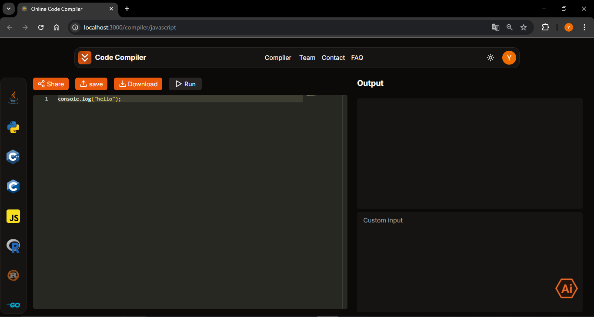

# Online Code Compiler

## <a href="https://github.com/Pal-Yogesh/onlinecodecompiler" target="_blank">Shadcn</a> + <a href="https://nextjs.org/" target="_blank">Next.js</a> + <a href="https://www.typescriptlang.org/" target="_blank">TypeScript</a> + <a href="https://tailwindcss.com/" target="_blank">Tailwind</a>.

### Compiler built in Latest Techs <a href="https://github.com/Pal-Yogesh/onlinecodecompiler" target="_blank">Check Here</a> NextJS and Typescript



## Sections

- [x] Navbar
- [x] Sidebar(mobile)
- [x] Hero
- [x] Features
- [x] Team
- [x] Contact
- [x] Frequently Asked Questions(FAQ)
- [x] Footer

## Features

- [x] Fully Responsive Design
- [x] User Friendly Navigation
- [x] Dark Mode

## How to install

1. Clone this repositoy:

```bash
git clone https://github.com/Pal-Yogesh/onlinecodecompiler
```

2. Go into project

```bash
cd onlinecodecompiler
```

3. Install dependencies

```bash
npm install
```

4. Run project

```bash
npm run dev
```
